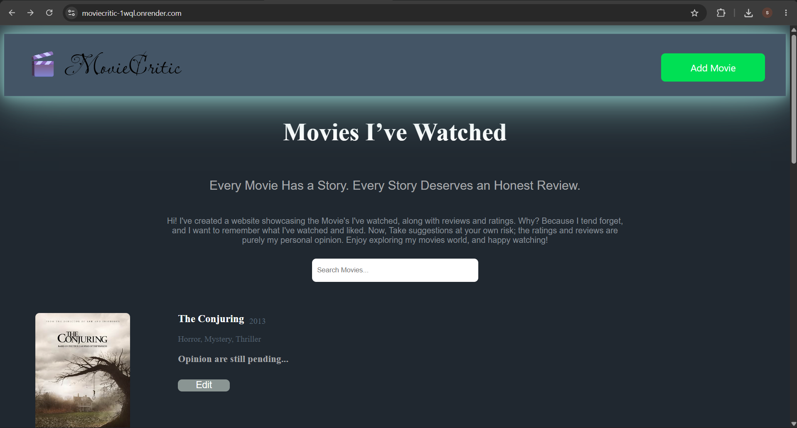

# 🎬 MovieCritic

MovieCritic is a full-stack web application where I can search for movies, save them to my personal collection, rate them, and write reviews. Movie details such as the poster, release year, and genre are fetched automatically using the OMDb API.

## 🌐 Live Demo
https://moviecritic-1wql.onrender.com

## ✨ Features

- 🔍 Search any movie using the OMDb API
- ⭐ Give movies a personal rating (1–10)
- 📝 Write and edit movie reviews
- 🎬 Automatically fetch movie posters and details
- ☁️ Cloud database with Neon PostgreSQL
- 🚀 Deployed on Render

## 🛠️ Tech Stack

### Frontend
- HTML
- CSS
- JavaScript
- EJS

### Backend
- Node.js
- Express.js

### Database
- PostgreSQL (Neon)

### APIs
- OMDb API

### Deployment
- GitHub
- Render

## 📷 Screenshots
<p align="center">
  
  
  
</p>

## 🚀 Running Locally

1. Clone the repository

```bash
git clone https://github.com/codewithsafa/MovieCritic.git
```

2. Install dependencies

```bash
npm install
```

3. Create a `.env` file

```env
DB_HOST=your_host
DB_USER=your_user
DB_PASSWORD=your_password
DB_NAME=your_database
DB_PORT=5432
OMDB_API_KEY=your_api_key
```

4. Start the server

```bash
node index.js
```


## 📌 Future Improvements

- User authentication
- Delete movies
- Sort and filter movies
- Responsive mobile design
- Search by genre
- Pagination

## 👨‍💻 Author

**Safa Alam**

Follow me on LinkedIn: https://www.linkedin.com/in/safa-alam19161?utm_source=share_via&utm_content=profile&utm_medium=member_android
